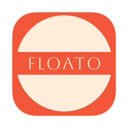

# Floato

<p align="center">
  
</p>

<p align="center">
  一款优雅的 macOS 番茄钟应用，采用悬浮窗设计，让专注变得简单。
</p>

<p align="center">
  <a href="https://github.com/youngfly93/Floato/releases"></a>
  <a href="https://github.com/youngfly93/Floato/blob/main/LICENSE"></a>
  <a href="https://github.com/youngfly93/Floato"></a>
</p>

## ✨ 特性

### 🎯 核心功能
- **悬浮窗设计** - 始终置顶的小巧窗口，不干扰工作流程
- **任务管理** - 支持创建、编辑和追踪多个番茄钟任务
- **任务分类** - 5种预设类别：工作、学习、运动、休息、个人
- **自定义时长** - 可调整番茄钟时长（1-60分钟）
- **休息提醒** - 自动进入5分钟休息时间

### 🎨 界面设计
- **毛玻璃效果** - 精致的半透明界面，与 macOS 完美融合
- **7段数码管** - 复古风格的时间显示
- **折叠/展开** - 双击可在迷你模式和完整模式间切换
- **动态高度** - 窗口高度根据任务数量自动调整

### 📊 统计功能
- **日活动热图** - 48个半小时时段的活动可视化
- **本周统计** - 过去7天的番茄钟完成情况
- **今日分布** - 上午、下午、晚上的时间分配饼图
- **类型分布** - 不同任务类别的使用统计
- **滑动切换** - 在同一窗口内左右滑动查看不同统计视图

### 🔔 系统集成
- **菜单栏图标** - 快速访问和控制
- **系统通知** - 任务完成和休息提醒
- **触感反馈** - 支持 MacBook 触控板震动反馈
- **开机自启** - 可设置随系统启动

## 📦 安装

### 下载安装
1. 从 [Releases](https://github.com/youngfly93/Floato/releases) 页面下载最新版本的 `Floato-x.x.dmg`
2. 双击打开 DMG 文件
3. 将 Floato 拖入应用程序文件夹
4. 首次打开时，可能需要在系统设置中允许运行

### 系统要求
- macOS 14.0 或更高版本
- 支持 Apple Silicon 和 Intel 处理器

## 🚀 使用方法

### 基本操作
1. **启动应用** - 点击菜单栏的番茄图标
2. **添加任务** - 在设置中创建新任务，选择类别和目标番茄数
3. **开始专注** - 点击任务开始计时
4. **查看进度** - 悬浮窗显示当前任务和剩余时间
5. **完成任务** - 计时结束后自动标记完成并进入休息

### 快捷操作
- **双击悬浮窗** - 切换折叠/展开状态
- **点击眼睛图标** - 显示/隐藏统计窗口
- **左右滑动** - 在统计窗口中切换不同视图

## 🛠️ 开发

### 技术栈
- **语言**: Swift 5
- **UI框架**: SwiftUI
- **最低版本**: macOS 14.0
- **架构**: MVVM + Actor-based concurrency

### 构建项目
```bash
# 克隆仓库
git clone https://github.com/youngfly93/Floato.git
cd Floato

# 使用 Xcode 打开
open Floato.xcodeproj

# 或使用命令行构建
xcodebuild -scheme Floato -configuration Release build
```

### 项目结构
```
Floato/
├── Floato/
│   ├── FloatoApp.swift          # 应用入口
│   ├── OverlayView.swift        # 悬浮窗主界面
│   ├── SettingsView.swift       # 设置界面
│   ├── TodoStore.swift          # 数据模型
│   ├── PomodoroClock.swift      # 计时器逻辑
│   ├── FloatingPanel.swift      # 悬浮窗管理
│   └── SystemHelpers.swift      # 系统功能集成
└── Floato.xcodeproj
```

## 📸 截图

<p align="center">
  
  
</p>

## 🤝 贡献

欢迎提交 Issue 和 Pull Request！

### 贡献指南
1. Fork 本仓库
2. 创建特性分支 (`git checkout -b feature/AmazingFeature`)
3. 提交更改 (`git commit -m 'Add some AmazingFeature'`)
4. 推送到分支 (`git push origin feature/AmazingFeature`)
5. 开启 Pull Request

## 📄 许可证

本项目采用 MIT 许可证 - 查看 [LICENSE](LICENSE) 文件了解详情。

## 🙏 致谢

- 使用 [Claude Code](https://claude.ai/code) 辅助开发
- 7段数码管字体来自开源社区
- 灵感来自各种优秀的番茄钟应用

## 📮 联系

- 作者: Yang Fei
- GitHub: [@youngfly93](https://github.com/youngfly93)

---

<p align="center">
  用 ❤️ 制作，让专注更简单
</p>